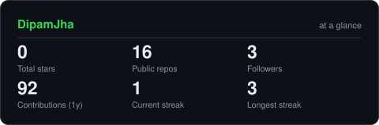

<div align="center">

<!-- Animated dot-matrix portrait, generated in the original template's style -->


<br>
<a href="https://github.com/DipamJha"></a>
<a href="mailto:Skyrix069@gmail.com"></a>
<a href="https://www.linkedin.com/in/dipam-jha/"></a>
<br><br>
</div>

---

## `~/` whoami

```console
$ whoami
Dipam Chandra Jha
$ focus
AI/ML • Backend Engineering • Problem Solving
```

Hey! I'm **Dipam**, a Computer Science student specializing in **Artificial Intelligence & Machine Learning** at **RNS Institute of Technology, Bengaluru**. I enjoy building practical software, exploring machine learning, and solving data structures and algorithm problems.

- 🎓 Pursuing B.E. in CSE (AI&ML), RNSIT
- 🤖 Exploring **Machine Learning, Generative AI, RAG, and Agentic AI**
- 🛠️ Building APIs, full-stack applications, and data-driven tools
- 🧩 Practicing **Data Structures & Algorithms** and strengthening core CS fundamentals
- 📫 Reach me at **[Skyrix069@gmail.com](mailto:Skyrix069@gmail.com)**

---

<div align="center">

## `~/` toolbox
### Languages

### Development

### Data, AI & Tools


</div>

---

<div align="center">
## `~/` skill radar
<table><tr>
<td width="50%" align="center" valign="middle"><picture><source media="(prefers-color-scheme: dark)" srcset="assets/radar-dark.svg"><source media="(prefers-color-scheme: light)" srcset="assets/radar-light.svg"></picture></td>
<td width="50%" align="center" valign="middle"><picture><source media="(prefers-color-scheme: dark)" srcset="assets/radar-langs-dark.svg"><source media="(prefers-color-scheme: light)" srcset="assets/radar-langs-light.svg"></picture></td>
</tr></table>
<sub>Skill radar values are editable self-assessments; language radar is generated from public repository data.</sub>
</div>

---

<div align="center">
## `~/` contribution calendar

<br><br><picture><source media="(prefers-color-scheme: dark)" srcset="https://raw.githubusercontent.com/DipamJha/DipamJha/output/snake-dark.svg"><source media="(prefers-color-scheme: light)" srcset="https://raw.githubusercontent.com/DipamJha/DipamJha/output/snake.svg"></picture>
</div>

---

<div align="center">
## `~/` the numbers
<picture><source media="(prefers-color-scheme: dark)" srcset="assets/card-stats-dark.svg"><source media="(prefers-color-scheme: light)" srcset="assets/card-stats-light.svg"></picture>
<br><br><br>
</div>

---

## `~/` selected work

| Project | Overview | Stack |
|---|---|---|
| [LinkForge](https://github.com/DipamJha/LinkForge) | Async URL shortener with custom aliases, expiration, Redis caching, and privacy-aware click analytics | FastAPI, PostgreSQL, SQLAlchemy, Redis |
| [RideBuddy](https://github.com/DipamJha/RideBuddy) | Ride-sharing coordination with Telegram bot commands, route alerts, and capacity handling | React, Node.js, MongoDB |
| [FoodScan](https://github.com/DipamJha/FoodScan) | Food-label scanning app to compare nutritional information | React, FastAPI |
| [Retail Demand Forecasting](https://github.com/DipamJha/Retail-Demand-Forecasting) | Product-level demand prediction and inventory reorder recommendations | Python, Pandas, XGBoost, SQL |

<sub>Verify project repository names before publishing; edit `assets/projects.json` if any slug differs.</sub>

---

<div align="center">
## `~/` beyond the code
🏆 **1st place** — CodeCraft Hackathon  
⚡ **Top 10** — Code Forge Hackathon  
🚀 **College-level qualifier** — Smart India Hackathon 2024  
🤝 Organized a **3-hour departmental hackathon** for 180 students
<br><br><sub>“Build, learn, iterate.”</sub>
</div>
